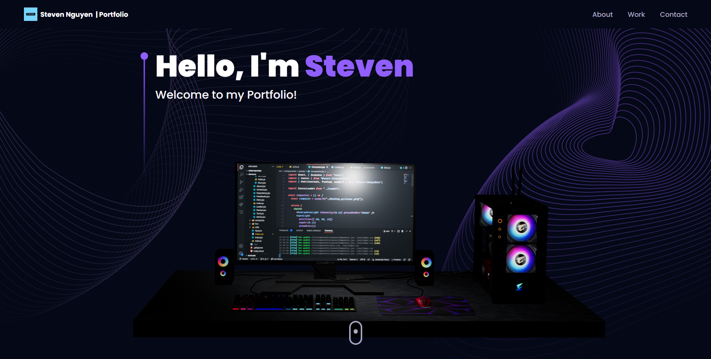
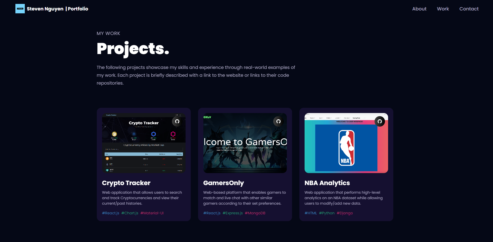
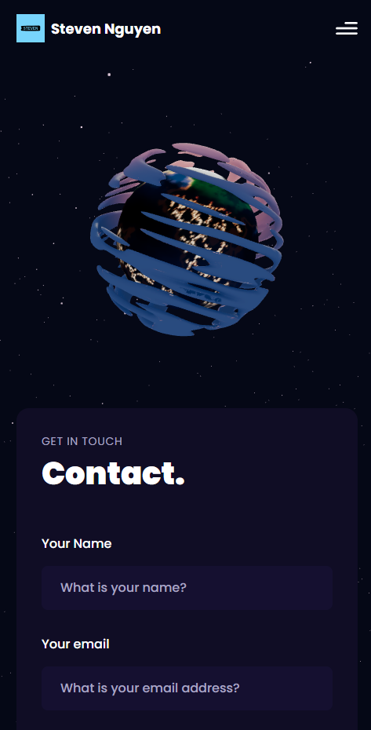

# Portfolio Website

My Web Portfolio

## <a href="https://stevens-portfolio.netlify.app/"> Deployed on Netlify </a>
_App is hosted on a free Netlify server. Please allow a few seconds for it to spin up._

Home Page 
 

Projects Page 
 

Mobile Responsive 
 

## Tech-Stack

Below is a non-exhaustive list of technologies used throughout the project.

<table>
      <thead>
        <tr>
          <th>Front End</th>
          <th>Frameworks</th>
        </tr>
      </thead>
      <tbody>
            <tr>
              <td>React.js</td>
              <td>Tailwind CSS</td>
            </tr>
            <tr>
              <td>Three.js</td>
              <td></td>
            </tr>
      </tbody>
  </table>
